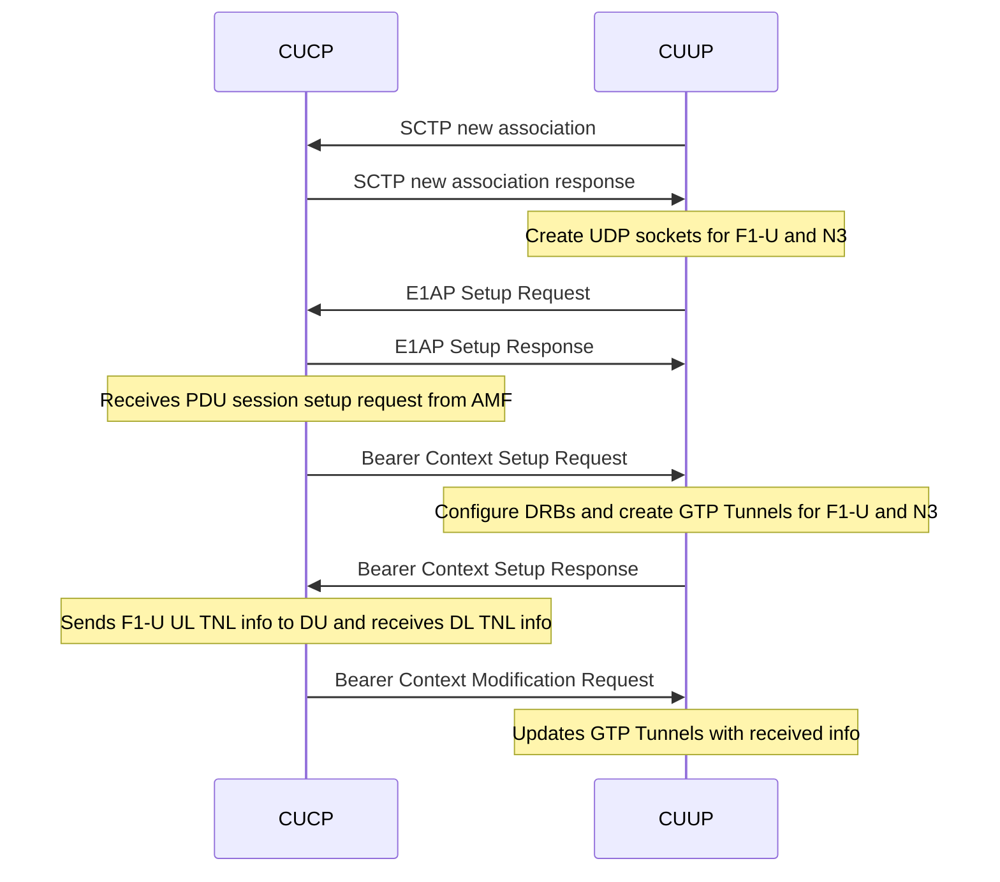

# 1. Introduction

E1 is named for the interface that lies between the nodes CU Control Plane (CUCP) and CU User Plane (CUUP). Once the nodes are configured, all user plane traffic flows through CUUP. This split is an option and when used, the design should follow the 3GPP specificaitons.

E1 design in OAI follows the 3GPP specification in TS 38.460 document. The code design on E1 in OAI is very similar to
F1. We use ITTI message passing mechanism to exchage messages between E1AP thread, SCTP thread and RRC thread.

The following sequence chart shows the current E1AP message flow.



# 2. Running the E1 Split

## 2.1 Configuration File
The gNB is started based on the node type that is specified in the configuration file. To start a gNB instance in CUCP or CUUP, the `tr_s_preference` should be set to "f1" and the config member `E1_INTERFACE` should be present in the config file. The `type` parameter within the `E1_INTERFACE` is used to specify if the node is a CUCP or CUUP. There are four other parameters used for specifying the interface information. A typical `E1_INTERFACE` config looks like

for CUCP
```
E1_INTERFACE =
(
  {
    type = "cp";
    ipv4_cucp = "127.0.0.4";
    port_cucp = 2152;
    ipv4_cuup = "127.0.0.5";
    port_cuup = 2152;
  }
)
```

and for CUUP
```
E1_INTERFACE =
(
  {
    type = "up";
    ipv4_cucp = "127.0.0.4";
    port_cucp = 2152;
    ipv4_cuup = "127.0.0.5";
    port_cuup = 2152;
  }
)
```
Once could take an exisiting CU configuration file and add the above parameters to run the gNB as CUCP or CUUP.

The CUUP uses the IP address specified in `ipv4_cuup` for F1-U and `GNB_IPV4_ADDRESS_FOR_NGU` for N3 links. Note that `GNB_IPV4_ADDRESS_FOR_NGU` is part of the `NETWORK_INTERFACES` config member and should be present in any gNB config file.  

Alternatively, you can use the config files `ci-scripts/conf_files/gNB_SA_CU_cp.conf` and `ci-scripts/conf_files/gNB_SA_CU_up.conf` which are already in the repository.

## 2.2 Steps to Run the Split in rfsimulator with OAI UE
Note: A 5G core must be running at this point. Steps to start the OAI 5G core can be found [here](https://gitlab.eurecom.fr/oai/cn5g/oai-cn5g-fed/-/blob/master/docs/DEPLOY_HOME.md).
1. We start the CUCP first by running the following command ```sudo ./nr-softmodem -O ../../../ci-scripts/conf_files/gNB_SA_CU_cp.conf --gNBs.[0].min_rxtxtime 6 --rfsim --sa```

Note that `min_rxtxtime` should be set to `6` only when you are connecting an OAI UE to the gNB. And `--rfsim` if you are running the test with rfsimulator.

2. We start the CUUP and DU (in any order)
CUUP:```sudo ./nr-softmodem -O ../../../ci-scripts/conf_files/gNB_SA_CU_up.conf --rfsim --sa```
DU:```sudo ./nr-softmodem -O ../../../ci-scripts/conf_files/gNB_SA_DU.conf --rfsim --sa```

3. Start OAI UE or COTS UE.
OAI UE: ```sudo RFSIMULATOR=127.0.0.1 ./nr-uesoftmodem -r 106 --numerology 1 --band 78 -C 3619200000 --nokrnmod --rfsim --sa```

4. Open wireshark to verify the E1AP messages.

You can also run the nodes on different machines. If you do so please change the `ipv4_cucp` and `ipv4_cuup` interfaces accordingly and make sure the interfaces are reachable.
